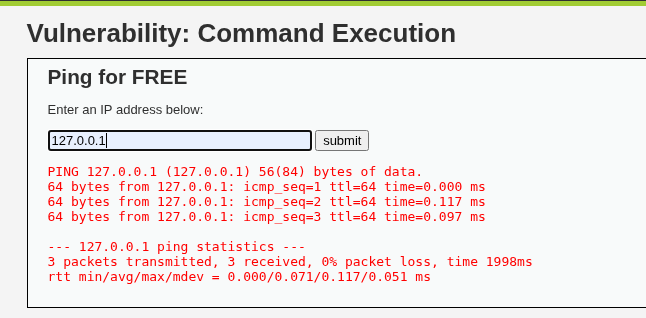
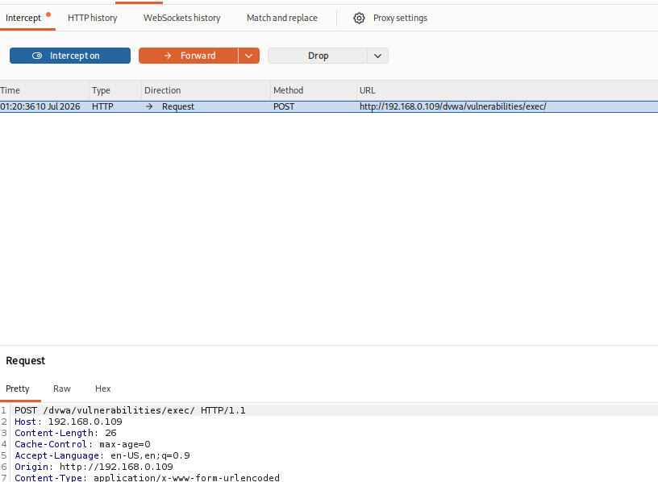
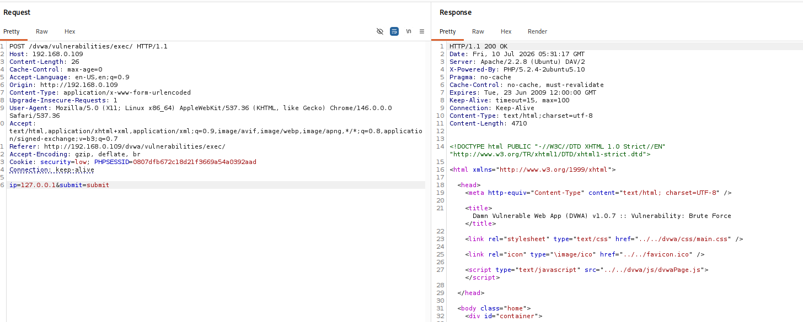
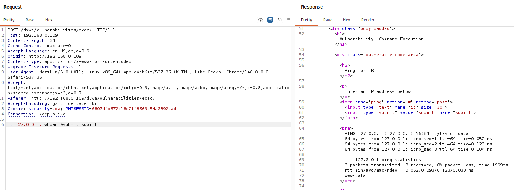
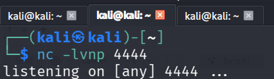
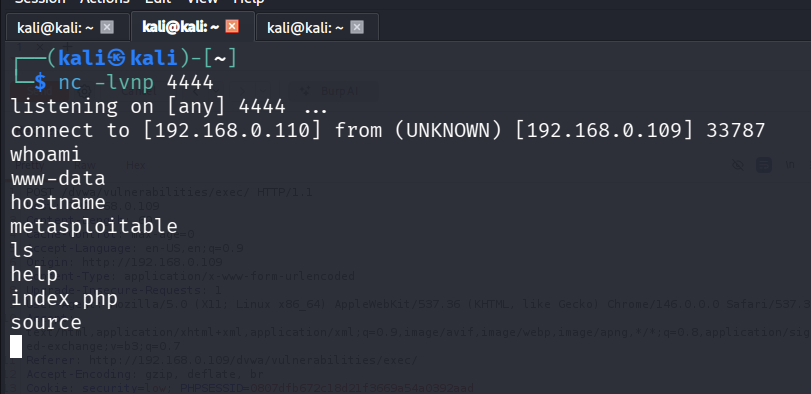

# Command Injection Screenshots

## 1. Normal Application Response

Shows the default application behavior when a valid IP address is submitted.

---

## 2. Burp HTTP POST Request

Burp Suite intercepting the POST request.

---

## 3. Original Request in Repeater

Original POST request before modification.

---

## 4. Successful Command Injection

The payload executes the `whoami` command.

---

## 5. Reading /etc/passwd

Sensitive file disclosure via command injection.

---

## 6. Netcat Listener

Attacker machine waiting for the reverse shell.

---

## 7. Reverse Shell Established

Reverse shell successfully obtained.

